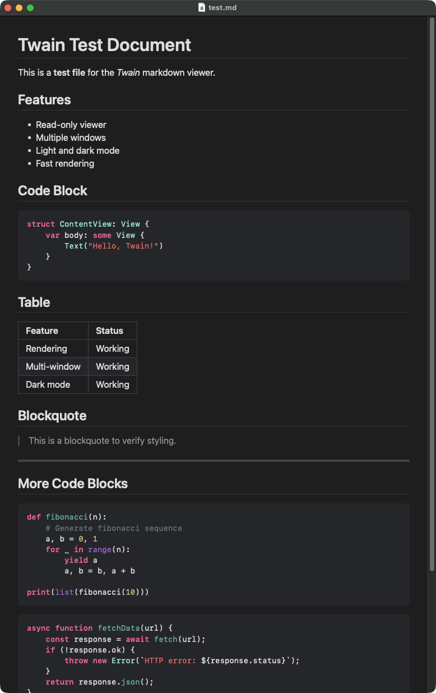

# Twain

A fast, minimal Markdown viewer for macOS. Read-only — no editing, just rendering.



## Requirements

- macOS 15 (Sequoia)
- Xcode 16+ / Swift 6

## Build & Run

```bash
./build.sh                 # debug build
./build.sh --release       # release build
./build.sh --run           # debug build and open
./build.sh --clean         # clean build artifacts
```

## Install

```bash
./install.sh
```

Installs `Twain.app` to `~/Applications` and a CLI wrapper to `~/.bin`, so you can run:

```bash
twain file.md
twain a.md b.md   # opens each in its own window
```

## Keyboard Shortcuts

| Shortcut | Action |
|----------|--------|
| Cmd+O | Open file |
| Cmd++ | Increase font size |
| Cmd+- | Decrease font size |
| Cmd+0 | Reset font size |
| Cmd+Shift+F | Toggle serif font |

Font size and font style preferences are saved and restored across app restarts.

## Theming

Twain supports custom themes via a JSON file at `~/.config/twain/theme.json`. Copy the included `theme.json` as a starting point:

```bash
mkdir -p ~/.config/twain
cp theme.json ~/.config/twain/theme.json
```

Edit colors (hex `#RRGGBB`), heading scales, code block styling, and more. See `theme.json` for all available options. If the file is missing or invalid, Twain falls back to its built-in defaults.

## Features

- Native syntax highlighting in code blocks (automatic language detection)
- Sans-serif and serif font options
- Persistent font size and style preferences
- Customizable theming via external JSON
- Light and dark mode support
- Multiple window support

## Stack

- SwiftUI + [Textual](https://github.com/gonzalezreal/textual) for native Markdown rendering with Prism.js syntax highlighting
- Swift Package Manager
- ~2MB release binary
